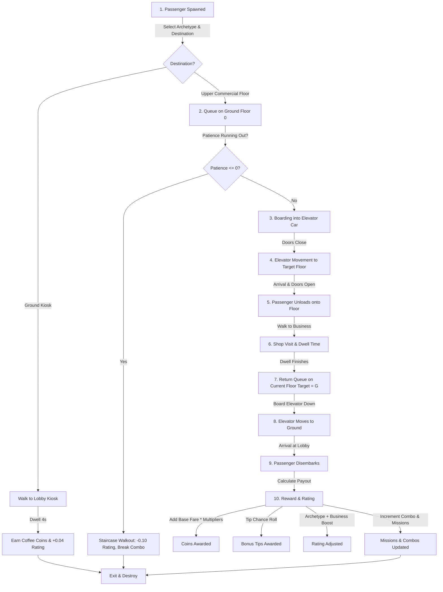
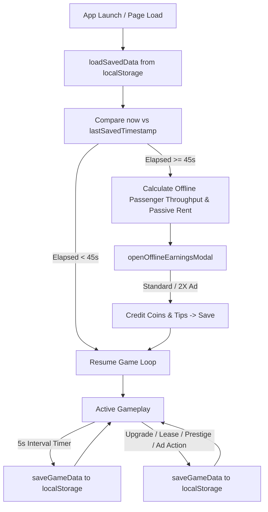

# Elevator Idle Architecture & Technical Specification

## Overview

**Elevator Idle** is a 2D mobile idle / skyscraper management simulation game built using **Phaser 3** and packaged for native Android via **Capacitor 8**. The elevator operates as the central mechanical bottleneck and progression driver for commercial skyscraper tenants, diverse passenger archetypes, and floor expansions.

- **Target Viewport**: 360 x 640 (Portrait)
- **Engine**: Phaser 3.60.0
- **Packaging / Native Bridge**: Capacitor 8 (`com.rkpdev.elevatoridle`)
- **Monetization**: Google AdMob (Rewarded Video) with automatic browser fallback
- **Audio**: Web Audio API (procedural synthesized sound effects)
- **Primary Source File**: `www/game.js`

---

## 1. Application Entry Point

- **File Location**: [index.html](file:///c:/Users/praja/OneDrive/Documents/Projects/ElevatorIdleGame/www/index.html) & [game.js](file:///c:/Users/praja/OneDrive/Documents/Projects/ElevatorIdleGame/www/game.js)
- **Main Responsibility**: Loads the Phaser 3 framework CDN, defines HTML viewport constraints, sets CSS reset styling, and mounts `game.js`.
- **Important Functions / Classes**:
  - `<!DOCTYPE html>` layout with flexbox centering (`#111` background).
  - Script tag loading Phaser 3.60.0 from CDN.
  - Script tag loading `game.js`.
- **Important State / Data**: Window dimensions, viewport meta tags.
- **Dependencies**: Browser DOM, Phaser 3 CDN.
- **Systems Depending On It**: All runtime game subsystems.

---

## 2. Phaser Initialization & Lifecycle

- **File Location**: [game.js](file:///c:/Users/praja/OneDrive/Documents/Projects/ElevatorIdleGame/www/game.js#L2-L17)
- **Main Responsibility**: Configures canvas scaling, dimensions, scene hooks (`create`, `update`), camera bounds, and free touch scroll handling.
- **Important Functions / Classes**:
  - `const config`: Phaser game configuration (`type: Phaser.AUTO`, `width: 360`, `height: 640`, scale mode `Phaser.Scale.FIT`, `autoCenter: Phaser.Scale.CENTER_BOTH`).
  - `const game = new Phaser.Game(config)`: Engine instance instantiation.
  - `create()`: Scene bootstrap (loads save data, initializes AdMob, checks offline earnings, creates textures, visual floors, elevator, HUD, spawner, and recurring timers).
  - `update(time, delta)`: Per-frame loop driving passenger waiting patience decay and staircase walkout triggers.
  - `setupFreeTouchScroll(scene)`: Drag-to-scroll camera handling (clamped between Y 0 and 320 across 1040px world bounds).
- **Important State / Data**:
  - Camera bounds: `(0, 0, 360, 1040)`
  - Scroll clamp: `Phaser.Math.Clamp(cameraStartY - deltaY, 0, 320)`
- **Dependencies**: Phaser Engine.
- **Systems Depending On It**: All game visual rendering and timing loops.

---

## 3. Game State Architecture

The runtime state is managed globally within `game.js` and synchronized with persistence:

| Domain | Key Variables | Description |
|---|---|---|
| **Economy** | `coins`, `tips`, `prestigeTokens`, `investorBoostTimeRemaining` | Primary cash, premium upgrade tips, prestige tokens, temporary +50% surge timer |
| **Reputation** | `buildingRating` | Clamped rating (1.0 to 5.0 ⭐) |
| **Elevator** | `currentFloor`, `isMoving`, `isBoarding`, `elevatorCapacity`, `moveDuration` | Position, movement state, boarding state, capacity, transit speed |
| **Progression** | `unlockedFloors`, `capacityLevel`, `speedLevel`, `skyscraperLevel`, `currentElevatorModelIndex` | Unlocked floor list `[0, 1, 2, ...]`, upgrade levels, building tier, active lift skin |
| **Breakdown** | `isBrokenDown`, `isRepairing`, `passengersTransported`, `passengersUntilBreakdown`, `repairTimeRemaining` | Wear counter, breakdown flag, active repair status, repair timer |
| **Automation** | `operatorTimeLeft`, `isOperatorActive` | Remaining operator duration (seconds), operator state |
| **Missions** | `activeMissions`, `consecutiveNoWalkout` | 3 active mission instances, clean service streak |
| **Combos & Events** | `serviceCombo`, `maxServiceComboLifetime`, `isComboPaused`, `activeRandomEvent`, `randomEventTimeRemaining` | Clean service multiplier, event state |
| **Entities** | `floorQueues`, `floorOccupants`, `elevatorPassengers`, `allActivePassengers`, `shops` | Floor queue arrays, dwelling occupants, passengers in lift, active shop data |

---

## 4. Elevator System

- **File Location**: [game.js](file:///c:/Users/praja/OneDrive/Documents/Projects/ElevatorIdleGame/www/game.js#L1840-L1970), [game.js](file:///c:/Users/praja/OneDrive/Documents/Projects/ElevatorIdleGame/www/game.js#L2620-L2760)
- **Main Responsibility**: Shaft rendering, elevator car positioning, door animations, mechanical cable updates, capacity LED indicator, floor button interaction, and transit tweens.
- **Important Functions / Classes**:
  - `createElevatorSystem(scene)`: Builds shaft background, cable line, car body, interior, doors, and capacity LED.
  - `updateElevatorCarSkin()`: Updates car stroke and interior colors based on `ELEVATOR_MODELS[currentElevatorModelIndex]`.
  - `updateCapacityLed()`: Sets LED color (Green = empty, Orange = partial, Red = full / broken).
  - `openElevatorDoors(scene, cb)` / `closeElevatorDoors(scene, cb)`: Cubic ease door slide animations (200ms).
  - `moveElevator(scene, targetFloor)`: Animates car vertically to destination with tween easing, cable redraw, bounce settle, and door opening.
  - `updatePassengersInsideElevator()`: Positions onboard passengers evenly within the car container.
  - `createFloorButtons(scene)` / `createSingleFloorButton(scene, x, y, label, targetFloor)`: Interactive floor call buttons.
- **Important State / Data**:
  - `elevatorContainer`, `elevatorCable`, `elevatorDoorLeft`, `elevatorDoorRight`, `capacityLed`.
  - `ELEVATOR_MODELS`: Array of cosmetic skins (`standard`, `glass_express`, `executive_gold`, `quantum_lift`) with prestige requirements and bonus tip percentages.
- **Dependencies**: `FLOOR_DEFINITIONS`, `floorY`, Audio Engine, Passenger System, Breakdown System, Random Events (`power_surge` speed penalty).
- **Systems Depending On It**: Passenger boarding/unloading, Operator Automation, Breakdown/Repair, UI HUD.

---

## 5. Passenger System

- **File Location**: [game.js](file:///c:/Users/praja/OneDrive/Documents/Projects/ElevatorIdleGame/www/game.js#L2260-L2545), [game.js](file:///c:/Users/praja/OneDrive/Documents/Projects/ElevatorIdleGame/www/game.js#L2740-L2910)
- **Main Responsibility**: Generates procedural solid character textures, spawns passenger archetypes based on building rating and floor business bias, manages queues, handles waiting patience decay, controls boarding/unboarding, drives staircase walkouts, and completes shop visits.
- **Important Functions / Classes**:
  - `generateSolidTextures(scene)`: Procedurally rasterizes solid pixelated character textures (`tex_shopper`, `tex_student`, `tex_senior`, `tex_vip`, `tex_celebrity`, `tex_exec`, `tex_investor`, `tex_tourist`, `tex_rusher`, `tex_mechanic`) onto Phaser texture manager.
  - `spawnPassenger(scene)`: Selects target floor, filters eligible archetypes by `buildingRating`, biases toward business type preferences, creates passenger container (sprite, destination tag bubble, patience bar, special badge), and enqueues passenger.
  - `spawnCelebrityPassenger(scene)`: Guaranteed celebrity spawn helper used during celebrity events.
  - `handleLobbyKioskVisitor(scene, passenger)`: Ground floor kiosk customer flow (dwells 4s, pays coffee coin, exits).
  - `animateWalkTo(scene, passenger, targetX, targetY, onComplete)`: Linear walking animation with subtle vertical bobbing.
  - `triggerStaircaseWalkout(scene, passenger)`: Triggers angry emoji, breaks combo, docks -0.10 ⭐ rating, and steps passenger down stairwell.
  - `checkBoarding(scene)`: Shifts passengers from `floorQueues[currentFloor]` into `elevatorPassengers` up to `elevatorCapacity`.
  - `unloadPassengers(scene)`: Disembarks passengers arriving at their target floor.
  - `transitionToShopDwell(scene, passenger)`: Handles tenant visit duration (`dwellMin` to `dwellMax`) before queueing for return ride to Ground (G).
  - `completeReturnJourney(scene, passenger)`: Resolves final ride payout (coins, tips, investor surge, rating bonus, combo multiplier, mission progress) and destroys entity.
- **Important State / Data**:
  - `ARCHETYPES`: Definitions with speeds, patience values, tip chances, coin multipliers, rating bonuses, color palettes, and special flags.
  - `floorQueues`, `floorOccupants`, `elevatorPassengers`, `allActivePassengers`.
- **Dependencies**: Elevator System, Shop System, Economy System, Rating System, Audio Engine, Missions System, Service Combo System.
- **Systems Depending On It**: Economy (fares/tips), Rating (bonuses/penalties), Missions (passenger/coin counts), Elevator Wear/Breakdown.

---

## 6. Shop / Commercial Business System

- **File Location**: [game.js](file:///c:/Users/praja/OneDrive/Documents/Projects/ElevatorIdleGame/www/game.js#L29-L210), [game.js](file:///c:/Users/praja/OneDrive/Documents/Projects/ElevatorIdleGame/www/game.js#L1580-L1838)
- **Main Responsibility**: Manages floor construction, commercial tenant leasing contracts, passive rent cycles, tenant rating requirements, and passenger attraction bias.
- **Important Functions / Classes**:
  - `BUSINESS_TYPES`: Configuration object detailing visitor frequency, dwell time ranges, passenger archetype bias pools, coin/tip/rent multipliers, and rating impact for each category (`CAFE`, `SHOPPING`, `OFFICE`, `GYM`, `ENTERTAINMENT`, `LUXURY`).
  - `FLOOR_DEFINITIONS`: Floor metadata (Ground through Floor 5), themes, unlock costs, default tenants, and advertising tier options.
  - `renderFloorStructure(scene, floor)`: Renders either an active/vacant shop slot or a locked construction slot.
  - `renderLockedConstructionSlot(scene, floor)`: Interactive unlock UI for unbuilt floors.
  - `renderShopSlot(scene, floor)`: Interactive tenant unit UI with contract countdown and rent info.
  - `handleShopRentAndLifecycle(scene)`: 6-second recurring loop collecting passive tenant rent, decreasing contract timers, and handling tenant departure if rating falls below 1.2 ⭐.
  - `openAdvertisingModal(scene, floor)` / `signTenantContract(scene, floor, tier)`: Modal allowing players to purchase Local Flyer (Standard) or Digital Campaign (Premium) advertising to sign new business contracts.
  - `getBusinessTypeForFloor(floor)`: Returns active `BUSINESS_TYPES` entry for a given floor.
- **Important State / Data**: `shops` object, `unlockedFloors`, `FLOOR_UNLOCK_COSTS`.
- **Dependencies**: Economy (construction/ad costs, rent income), Rating System (unlocks premium campaigns), Audio Engine.
- **Systems Depending On It**: Passenger Spawning (destination choice and passenger pool weighting), Economy (passive rent), Offline Earnings calculation, Missions System.

---

## 7. Economy System

- **File Location**: [game.js](file:///c:/Users/praja/OneDrive/Documents/Projects/ElevatorIdleGame/www/game.js#L19-L28), [game.js](file:///c:/Users/praja/OneDrive/Documents/Projects/ElevatorIdleGame/www/game.js#L833-L1008), [game.js](file:///c:/Users/praja/OneDrive/Documents/Projects/ElevatorIdleGame/www/game.js#L2800-L2920)
- **Main Responsibility**: Manages dual currencies (Coins and Tips/Gems), calculates ride fares with layered multipliers, processes tenant rent, and calculates offline idle earnings.
- **Important Functions / Classes**:
  - `updateHUD()`: Updates on-screen coin, tip, combo, and mission texts.
  - `showFloatingText(scene, x, y, text, color)`: Rising fading text indicator for financial gains and events.
  - `checkAndShowOfflineEarnings(scene)`: Calculates earnings accumulated during absence (capped at 8 hours), accounting for active shops, passenger throughput, rent efficiency, and rating bonuses.
  - `openOfflineEarningsModal(scene, data)` / `collectOfflineEarnings(scene, multiplier)`: Welcome back modal with standard collection or 2X rewarded ad option.
- **Important State / Data**:
  - `coins` (Primary currency for floor unlocks, tenant advertising, operator hiring, repairs).
  - `tips` (Premium currency for elevator capacity and speed upgrades).
  - `prestigeTokens` (+20% permanent boost per token).
  - Multipliers: Base Fare `(5 + floorBonus) * archCoinMult * businessCoinMult * prestigeBonus * investorBonus * comboMultiplier * corpEventBonus`.
- **Dependencies**: UI System, Audio Engine, Save System.
- **Systems Depending On It**: Upgrades, Floor Building, Tenant Advertising, Operator Hiring, Repairs, Missions.

---

## 8. Rating System

- **File Location**: [game.js](file:///c:/Users/praja/OneDrive/Documents/Projects/ElevatorIdleGame/www/game.js#L22), [game.js](file:///c:/Users/praja/OneDrive/Documents/Projects/ElevatorIdleGame/www/game.js#L798-L832), [game.js](file:///c:/Users/praja/OneDrive/Documents/Projects/ElevatorIdleGame/www/game.js#L2544-L2548)
- **Main Responsibility**: Tracks skyscraper reputation score (1.0 to 5.0 ⭐).
- **Important Functions / Classes**:
  - `modifyBuildingRating(scene, delta)`: Clamps rating between `1.0` and `5.0` and updates UI.
  - `showRewardedAdForPRRatingBoost(scene)`: Ad action resetting building rating instantly to `5.0` ⭐.
- **Rating Impacts**:
  - **Increase**: Satisfied passenger return journey (`+0.04` to `+0.20` depending on archetype + business impact), kiosk visit (`+0.04`).
  - **Decrease**: Passenger staircase walkout (`-0.10`).
  - **Effects**: Determines unlock eligibility for VIP/Celebrity/Executive/Investor spawns, determines eligibility for Premium Digital Advertising campaigns (needs 2.5+ ⭐), triggers tenant abandonment if rating drops $\le 1.2$ ⭐.
- **Dependencies**: UI System, Audio Engine, Ads System.
- **Systems Depending On It**: Passenger Spawning, Shop Leasing, Offline Earnings.

---

## 9. Upgrades System

- **File Location**: [game.js](file:///c:/Users/praja/OneDrive/Documents/Projects/ElevatorIdleGame/www/game.js#L288-L304), [game.js](file:///c:/Users/praja/OneDrive/Documents/Projects/ElevatorIdleGame/www/game.js#L1970-L2085)
- **Main Responsibility**: Manages elevator capacity and speed upgrades purchased using tips.
- **Important Functions / Classes**:
  - `createBottomUpgradePanel(scene)`: Pinned bottom panel holding Hire, Boost, Capacity, and Speed cards.
  - `createUpgradeProgressButton(...)`: Custom UI button with level label, tip cost, and graphical progress fill bar.
  - `updateUpgradeCards()`: Refreshes upgrade button labels, costs, and progress bars.
- **Important State / Data**:
  - `capacityLevel` (Max 5): Costs `[50, 150, 400, 1000, 2500, 5000] 💎`, yields capacities `[2, 3, 4, 5, 6, 8]`.
  - `speedLevel` (Max 5): Costs `[50, 120, 300, 750, 1800, 4500] 💎`, yields move durations `[850, 720, 600, 480, 380, 280] ms`.
- **Dependencies**: Economy System (`tips`), Audio Engine, Save System.
- **Systems Depending On It**: Elevator transit timing, Elevator passenger capacity, Skyscraper Prestige requirements.

---

## 10. Operator Automation System

- **File Location**: [game.js](file:///c:/Users/praja/OneDrive/Documents/Projects/ElevatorIdleGame/www/game.js#L305-L309), [game.js](file:///c:/Users/praja/OneDrive/Documents/Projects/ElevatorIdleGame/www/game.js#L1064-L1068), [game.js](file:///c:/Users/praja/OneDrive/Documents/Projects/ElevatorIdleGame/www/game.js#L2550-L2598)
- **Main Responsibility**: Autonomous elevator controller loop that drives lift operations when an operator is hired or boosted.
- **Important Functions / Classes**:
  - `handleOperatorTick(scene)`: 1-second interval loop decrementing `operatorTimeLeft` and triggering AI logic.
  - `runOperatorAI(scene)`: Priority dispatch heuristic:
    1. Deliver onboard passengers to destination floor (`elevatorPassengers[0].targetFloor`).
    2. Check upper floor return queues descending from top unlocked floor to 1.
    3. Check ground floor queue (Floor 0).
    4. Board waiting passengers and move immediately.
- **Important State / Data**: `operatorTimeLeft`, `isOperatorActive`, `operatorStatusText`.
- **Dependencies**: Elevator System, Passenger System, Economy (Hire: 40 💰 for +30s), Ads (Boost: Ad for +60s).
- **Systems Depending On It**: Idle background progression.

---

## 11. Breakdown & Repair System

- **File Location**: [game.js](file:///c:/Users/praja/OneDrive/Documents/Projects/ElevatorIdleGame/www/game.js#L321-L330), [game.js](file:///c:/Users/praja/OneDrive/Documents/Projects/ElevatorIdleGame/www/game.js#L2112-L2257)
- **Main Responsibility**: Simulates mechanical elevator wear and failure, pauses elevator operations, and provides repair options.
- **Important Functions / Classes**:
  - `checkElevatorWear(scene)`: Increments `passengersTransported`; triggers breakdown upon reaching wear limit (randomized 25–35 passengers).
  - `triggerElevatorBreakdown(scene)`: Halts lift, pauses combos safely, flashes red warning banner, plays alarm, and opens repair modal.
  - `openBreakdownModal(scene)`: Presents Standard Repair (25 Coins, 18s) vs Fast Fix (Rewarded Ad, 0s).
  - `startStandardRepair(scene)`: Spawns animated mechanic entity with wrench animation and progress bar.
  - `completeRepair(scene)`: Clears breakdown state, resets wear counter (25–35), dismisses mechanic, and resumes normal service.
- **Important State / Data**: `isBrokenDown`, `isRepairing`, `passengersTransported`, `passengersUntilBreakdown`, `repairTimeRemaining`, `breakdownBanner`, `mechanicContainer`.
- **Dependencies**: Elevator System, Economy System, Ads System, Audio Engine.
- **Systems Depending On It**: Elevator movement & boarding (blocked during breakdown), Service Combo (paused during breakdown).

---

## 12. UI & Modal Architecture

- **File Location**: [game.js](file:///c:/Users/praja/OneDrive/Documents/Projects/ElevatorIdleGame/www/game.js#L1267-L1538), [game.js](file:///c:/Users/praja/OneDrive/Documents/Projects/ElevatorIdleGame/www/game.js#L3048-L3107)
- **Main Responsibility**: Manages fixed camera HUD overlays (`setScrollFactor(0)`), pinned panels, interactive action buttons, and modal dialog containers.
- **Key UI Components**:
  - **Pinned Top HUD**: Coin counter, tip counter, rating stars, operator timer, combo indicator, Tasks button, HQ Management button, sound toggle (`depth: 100-103`).
  - **Sub-Header Banners**: Active Mission teaser banner (`depth: 100`), Random Event countdown banner (`depth: 120`).
  - **Bottom Upgrade Panel**: Pinned dashboard for Operator Hire, Video Boost, Capacity Upgrades, and Speed Upgrades (`depth: 100-103`).
  - **Modals (Containers at `depth: 200-250`)**:
    - `Missions Modal`: 3 active objective cards with progress bars and claim buttons.
    - `HQ / Skyscraper Management Modal`: Lifetime stats, lift skin selector, and Skyscraper Prestige reset.
    - `Breakdown Modal`: Standard coin fix vs Fast Ad fix.
    - `Advertising / Leasing Modal`: Tenant selection (Flyers vs Digital Campaign vs PR Stunt Ad).
    - `Offline Earnings Modal`: Absence summary with Standard Collect and 2X Video Reward.
    - `Dev Events Modal`: Developer trigger interface for testing all random events.
- **Dependencies**: Phaser Scene & Camera.
- **Systems Depending On It**: User interaction across all gameplay loops.

---

## 13. Audio Engine

- **File Location**: [game.js](file:///c:/Users/praja/OneDrive/Documents/Projects/ElevatorIdleGame/www/game.js#L446-L564)
- **Main Responsibility**: Generates pure Web Audio API procedural sound effects using oscillators and gain envelopes without external asset files.
- **Synthesized Sound Effects**:
  - `ding`: Two-tone sine chime (587 Hz $\rightarrow$ 880 Hz) for elevator arrival and completions.
  - `coin`: Triangle waveform frequency step (987 Hz $\rightarrow$ 1318 Hz) for income collection.
  - `tip`: 4-note ascending arpeggio (C6, E6, G6, C7) for tips and major milestones.
  - `click`: Quick descending pitch blip for UI buttons.
  - `door`: Triangle low-frequency glide (140 Hz $\rightarrow$ 180 Hz) for sliding doors.
  - `alarm`: Sawtooth frequency alarm for breakdowns and warnings.
  - `wrench`: Short square wave tap (800 Hz $\rightarrow$ 300 Hz) for mechanic repairs.
  - `build`: Triangle upward sweep (300 Hz $\rightarrow$ 600 Hz) for construction and prestige.
- **Important State / Data**: `audioCtx`, `isAudioMuted`.
- **Dependencies**: Web Audio API (`window.AudioContext`).
- **Systems Depending On It**: All user actions and game event feedback.

---

## 14. Ads System (AdMob & Browser Fallback)

- **File Location**: [game.js](file:///c:/Users/praja/OneDrive/Documents/Projects/ElevatorIdleGame/www/game.js#L724-L832), [game.js](file:///c:/Users/praja/OneDrive/Documents/Projects/ElevatorIdleGame/www/game.js#L984-L1008)
- **Main Responsibility**: Interfaces with `@capacitor-community/admob` on native Android and provides transparent fallback for browser testing.
- **Rewarded Ad Placements**:
  1. **Operator Boost** (`showRewardedAdForBoost`): Grants +60s automation.
  2. **Fast Repair** (`showRewardedAdForInstantRepair`): 0s instant breakdown fix.
  3. **PR Stunt** (`showRewardedAdForPRRatingBoost`): Resets building reputation to 5.0 ⭐.
  4. **Offline 2X Reward** (`claim2xOfflineAdReward`): Doubles offline coin and tip payouts.
- **Configuration**:
  - AdMob App ID: `ca-app-pub-7809965112838039~2020878812` (in `AndroidManifest.xml`)
  - Ad Unit ID: `ca-app-pub-7809965112838039/5774818818` (Rewarded Video)
- **Dependencies**: Capacitor Core, `@capacitor-community/admob`.
- **Systems Depending On It**: Operator, Breakdown, Rating, Offline Earnings.

---

## 15. Save / Load & Persistence System

- **File Location**: [`www/save/saveManager.js`](file:///c:/Users/praja/OneDrive/Documents/Projects/ElevatorIdleGame/www/save/saveManager.js)
- **Main Responsibility**: Serializes and deserializes game state to `localStorage` under key `elevator_idle_save` with built-in versioning and backwards-compatible migrations.
- **Current Save Version**: `1` (`CURRENT_SAVE_VERSION`)
- **Versioning & Migration Logic**:
  - Automatically detects missing `saveVersion` in legacy player saves and treats them as version 1.
  - Applies sequential migration transformations (`migrateSaveData`) when upgrading between save versions.
  - Safely retains unknown future fields and prevents downgrading if loaded by an older build.
  - Validates missing or partial fields gracefully with sensible fallback defaults without resetting progress.
- **Save Triggering**: Auto-saves every 5 seconds, plus immediate saves on upgrade purchase, tenant lease, prestige, offline claim, and rating change.
- **Save Payload Structure**:
  ```json
  {
    "saveVersion": 1,
    "coins": 1500,
    "tips": 120,
    "buildingRating": 4.2,
    "isAudioMuted": false,
    "unlockedFloors": [0, 1, 2, 3],
    "capacityLevel": 2,
    "speedLevel": 2,
    "skyscraperLevel": 1,
    "prestigeTokens": 0,
    "totalPassengersServedLifetime": 140,
    "totalCoinsEarnedLifetime": 3200,
    "specialPassengersTransported": 18,
    "maxServiceComboLifetime": 12,
    "currentElevatorModelIndex": 0,
    "lastSavedTimestamp": 1771560000000,
    "activeMissions": [ ... ],
    "consecutiveNoWalkout": 8,
    "shops": { ... }
  }
  ```
- **Dependencies**: `localStorage`, `JSON.stringify` / `JSON.parse`.
- **Systems Depending On It**: Game startup, progression continuity.

---

## 16. Android & Capacitor Integration

- **File Locations**:
  - [capacitor.config.json](file:///c:/Users/praja/OneDrive/Documents/Projects/ElevatorIdleGame/capacitor.config.json)
  - [package.json](file:///c:/Users/praja/OneDrive/Documents/Projects/ElevatorIdleGame/package.json)
  - [AndroidManifest.xml](file:///c:/Users/praja/OneDrive/Documents/Projects/ElevatorIdleGame/android/app/src/main/AndroidManifest.xml)
- **Main Responsibility**: Packages the web bundle (`www/`) into a native Android application with hardware-accelerated WebView and native plugin bridges.
- **Configuration Details**:
  - `appId`: `com.rkpdev.elevatoridle`
  - `appName`: `Elevator Idle`
  - `webDir`: `www`
  - Permissions: `android.permission.INTERNET`
  - Native Plugins: `@capacitor/android`, `@capacitor-community/admob`
- **Dependencies**: Gradle, Android SDK, Capacitor CLI.
- **Systems Depending On It**: Android APK distribution.

---

## 17. Development Mode & Sandbox Testing Tools

- **File Locations**:
  - [`www/config/devConfig.js`](file:///c:/Users/praja/OneDrive/Documents/Projects/ElevatorIdleGame/www/config/devConfig.js)
  - [`www/ui/devPanel.js`](file:///c:/Users/praja/OneDrive/Documents/Projects/ElevatorIdleGame/www/ui/devPanel.js)
- **Main Responsibility**: Provides isolated sandbox, debugging, and balance testing capabilities for developers without polluting production gameplay.
- **Activation Mechanism**:
  - Controlled by `DEV_CONFIG.ENABLED` in `www/config/devConfig.js`.
  - Can also be toggled at runtime via browser URL query parameter (`?dev=true` / `?dev=false`) or `window.DEV_MODE = true`.
  - When disabled, no dev UI or listeners are mounted into the scene.
- **Sandbox Controls Available in Dev Panel**:
  - **Economy**: `+100 Coins`, `+100 Tips`, `Reset Economy` (zero coins/tips).
  - **Passengers**: `Spawn Normal`, `Spawn VIP`, `Spawn Special`, `Clear All Passengers`.
  - **Elevator**: `Move to Floor 0`, `Move to Floor 1`, `Move to Floor 2`, `Move to Top Unlocked Floor`, `Fill Elevator`, `Empty Elevator`.
  - **Building & Rating**: `Unlock Next Floor`, `Set Rating 5.0 ⭐`, `Set Rating 1.0 ⭐`.
  - **Events & Breakdown**: `Trigger Random Event`, `End Current Event`, `Trigger Breakdown`, `Complete Repair`.
  - **Missions**: `Complete Current Mission`, `Reset Missions`.
  - **Save Management**: `Export Save Data` (JSON clipboard & log), `Reset Save Data` (localStorage wipe).
  - **Time Simulation**: `Simulate 1 Minute`, `Simulate 10 Minutes`, `Simulate 1 Hour`.
- **Dependencies**: Game state containers, system action runners.
- **Systems Depending On It**: Internal QA, testing, and debugging.

---

## Core Data & Progression Flows


### 1. Main Passenger Lifecycle & Service Loop



### 2. Save & Load Lifecycle Flow



---

## Gameplay Balance & Configuration Modules

In accordance with the architectural principle (**CODE = GAME LOGIC, CONFIG = BALANCE VALUES**), all balance parameters, economy multipliers, costs, timers, and thresholds are isolated in dedicated ES modules within the `www/config/` directory:

| Balance Domain | Configuration File | Constants & Parameters Defined |
|---|---|---|
| **Elevator Upgrades** | [`www/config/upgrades.js`](file:///c:/Users/praja/OneDrive/Documents/Projects/ElevatorIdleGame/www/config/upgrades.js) | `CAPACITY_COSTS`, `CAPACITY_VALUES`, `MAX_CAPACITY_LEVEL`, `SPEED_COSTS`, `SPEED_VALUES`, `MAX_SPEED_LEVEL` |
| **Floor Construction & Rent** | [`www/config/floors.js`](file:///c:/Users/praja/OneDrive/Documents/Projects/ElevatorIdleGame/www/config/floors.js) | `FLOOR_DEFINITIONS`, `FLOOR_UNLOCK_COSTS`, `advertisingTiers` (costs, rents, contract durations), `floorY` lookups |
| **Commercial Tenants** | [`www/config/businesses.js`](file:///c:/Users/praja/OneDrive/Documents/Projects/ElevatorIdleGame/www/config/businesses.js) | `BUSINESS_TYPES` (`CAFE`, `SHOPPING`, `OFFICE`, `GYM`, `ENTERTAINMENT`, `LUXURY`) with `visitorFrequency`, `dwellMin`/`dwellMax`, `coinMultiplier`, `tipMultiplier`, `rentMultiplier`, `ratingImpact` |
| **Passenger Archetypes & Missions** | [`www/config/passengers.js`](file:///c:/Users/praja/OneDrive/Documents/Projects/ElevatorIdleGame/www/config/passengers.js) | `ARCHETYPES` (speed, patience, tip chance, multipliers), `ELEVATOR_MODELS` (prestige requirements, tip buffs), `MISSION_TEMPLATES` (targets, rewards), `RANDOM_EVENTS` (durations, effects) |
| **Economy, Multipliers & Offline** | [`www/config/economy.js`](file:///c:/Users/praja/OneDrive/Documents/Projects/ElevatorIdleGame/www/config/economy.js) | `BASE_FARE`, high floor increments, kiosk coffee rewards, prestige multiplier rate, investor surge multiplier & duration, service combo scaling, event multipliers, archetype `TIP_RANGES`, and offline simulation parameters (`MIN_SECONDS`, `MAX_SECONDS`, `RENT_EFFICIENCY`, `AVG_BASE_FARE`, `TIP_RATE_FACTOR`) |
| **Elevator Wear & Breakdown** | [`www/config/breakdown.js`](file:///c:/Users/praja/OneDrive/Documents/Projects/ElevatorIdleGame/www/config/breakdown.js) | `MIN_PASSENGERS_THRESHOLD` & `MAX_PASSENGERS_THRESHOLD` (25–35 wear limits), `STANDARD_REPAIR_COST` (25 💰), `STANDARD_REPAIR_DURATION_SEC` (18s), `AD_REPAIR_DURATION_SEC` (0s) |
| **Operator Automation** | [`www/config/operator.js`](file:///c:/Users/praja/OneDrive/Documents/Projects/ElevatorIdleGame/www/config/operator.js) | `HIRE_COIN_COST` (40 💰), `HIRE_DURATION_SEC` (30s), `BOOST_DURATION_SEC` (60s), `TICK_INTERVAL_MS` (1000ms) |
| **Game Timing & Rating Thresholds** | [`www/config/timing.js`](file:///c:/Users/praja/OneDrive/Documents/Projects/ElevatorIdleGame/www/config/timing.js) | Spawner interval (3400ms), shopping rush bonus delay (1600ms), shop rent loop (6000ms), auto-save (5000ms), natural event frequency & probability, rating bounds (`1.0` to `5.0` ⭐), default rating (`3.5`), walkout penalty (`-0.10`), digital campaign rating requirement (`2.5`), tenant departure rating threshold (`1.2`) |
| **Phaser Engine Config** | [`www/config/gameConfig.js`](file:///c:/Users/praja/OneDrive/Documents/Projects/ElevatorIdleGame/www/config/gameConfig.js) | Viewport dimensions (`360x640`), scale mode (`Scale.FIT`), background canvas color (`#111116`) |

---

## Future Architecture Guidelines

As outlined in [AGENTS.md](file:///c:/Users/praja/OneDrive/Documents/Projects/ElevatorIdleGame/AGENTS.md), when modularizing or adding new major game systems:
- **Configuration** belongs in `config/` (e.g. business types, floor stats, archetypes, economy balance).
- **Gameplay systems** belong in `systems/` (e.g. mission system, event system, economy engine).
- **UI modules** belong in `ui/` (e.g. modals, HUD controllers).
- **Entity classes** belong in `entities/` (e.g. Passenger, Elevator, Mechanic).
- `game.js` must remain the clean application entry point.
- Existing save schema keys must remain backwards-compatible.

